```{r setup, include=FALSE}
knitr::opts_chunk$set(echo = TRUE)
library(tidyverse)
library(here)
```

## Pace Partners in Zwift

What are Pace Partners?

From Zwift Insider:

*Pace Partners are bots, not real people. They ride at a consistent pace on a particular route, and you can easily join them if you're looking to ride with others.*

Pace Partners are always-on group rides in Watopia, rotating between 3 routes, at 4 different speeds (w/kg), which usually draw a good crowd for drafting and for sharing Ride Ons.

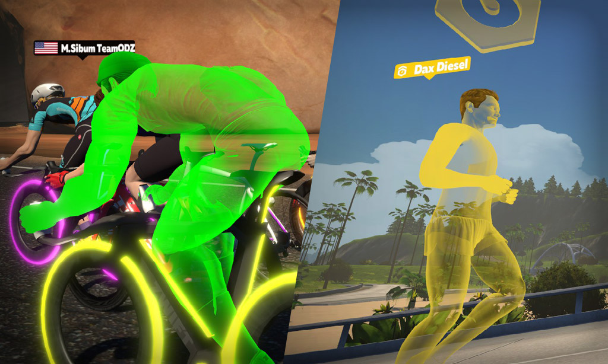

So why can't we all have our own custom Pace Partners? It would be awesome!

Zwifters love the idea of their own customized Pace Partners, as they know it is very motivating to chase someone just a bit faster than you.

However, this would be very computationally expensive for up to 46,000+ riders. Custom pace partners for everyone is impractical, unless (maybe) this is done on the client side (rather than on the ZHQ servers), and your phone/android tablet/12 year old iMac is probably not up to running Zwift, your avatar, and a Pace Partner all at once.

But there is a reasonable approximation that ***could*** be created.

## Why Does Everyone *Want* Their Own Custom Pace Partner?

Because it is really effective training to push yourself to keep up with someone who is a little bit faster than you. Out on the road IRL, it is a lot of fun to catch someone just a little bit faster than you, and to try to hang on as long as you can. You can stretch yourself, but not too much, and hide in the draft when you need to rest. It would be ideal to train with someone who is always (just a little bit) faster than you, and try to keep up. This is what is called Progressive Resistance Exercise (PRE).

## What is Progressive Resistance Exercise (PRE)?

Progressive Resistance Exercise, or PRE, is used in sports training, physical therapy (physiotherapy), and any time you want to get stronger.

The benefits of PRE include increased ability of the trained muscles to produce force, benefits that occur across the range of fitness, from the very unfit to the very fit, lowering blood pressure, and a long record of safety, even in folks who have suffered bone fractures or other injuries.

A review of Progressive Resistance Exercise with details on existing studies can be found [here](https://academic.oup.com/ptj/article/85/11/1208/2805087).

Typical examples of PRE include

-   Increasing resistance to exercise with graded therapy bands (usually in different colors, with increasing thickness) in physical therapy after an injury.

-   Weight training, by adding a small increment of weight regularly.

-   Weighted vests for runners, treadmills that slope upward

-   Training for a century ride - you increase your mileage by \~ 5-10% per week.

The key to PRE is to increase the resistance or task by small increments to reach a larger goal. Large increases in difficulty will lead to failure, and often a discouraged participant.

## Why is PRE more fun than a disciplined training plan?

There is a lot of evidence behind HIIT and organized training plans, but they (will and should) hurt. And it is not terribly motivating to stare at a list of intervals while you are suffering. On the other hand, competing with other avatars in a race, or in trying to keep up with a pack, is pretty motivating. Taking the example of Boone, who has been training with Eric (*Couch to Cat C*, *C to B* blog series posts on ZwiftInsider), both races and chasing Pace Partners are fun for him. The VO2 intervals are effective, but are a bit like taking medicine. This is true for a lot of people, especially for the folks who choose Zwift over something like TrainerRoad. It may just be how we are wired.

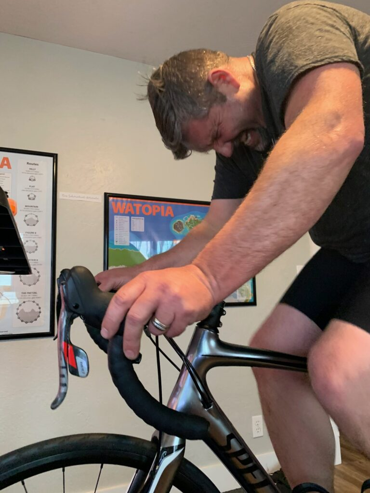

## How Well do Pace Partners work for Progressive Resistance Exercise?

The four cycling Pace Partners keep a steady watts per kilogram (w/kg) which could make for a good progressive resistance training experience. However, there has been a lot of vigorous discussion/complaints on the Zwift Forums about the leap from 1.5 w/kg with D. Diesel to 2.5 w/kg with C. Cadence. Many riders feel that the gap between D and C is too large. Is that really a problem? Let's see how this measures up with a table.

| Pace Partner | W/KG | Percent Increase |
|--------------|------|------------------|
| D. Diesel    | 1.5  | --               |
| C. Cadence   | 2.5  | 66.6%            |
| B. Brevet    | 3.2  | 28.0%            |
| A. Anquetil  | 4.2  | 31.3%            |

: Existing Cycling Pace Partners with watts per kilogram and percent increase.

As you can see, there is a \~ 30% jump between C and B, and between B and A, but the leap from D to C is more than twice as large. The folks trying to make the leap from D to C have a strong case that another Pace Partner, between D and C, is needed. Their complaints appear to be justified.

## What would this look like with 5 Cycling Pace Partners?

A new version with 5 Pace Partners could even out the difficulty progressions to be all close to 30%, without big changes in watts per kilogram. Note that this new proposed version includes updated colors to match the color zones in Zwift (which also match the color order of a rainbow, so that it is easy to remember).

| Pace Partner | W/KG | Percent Increase | Color  |
|--------------|------|------------------|--------|
| E. Endura    | 1.5  | --               | Blue   |
| D. Diesel    | 1.95 | 30.0%            | Green  |
| C. Cadence   | 2.55 | 30.7%            | Yellow |
| B. Brevet    | 3.3  | 29.4%            | Orange |
| A. Anquetil  | 4.3  | 30.3%            | Red    |

: New Cycling Pace Partners with watts per kilogram and percent increase (and ordered colors).

By adding a 5th Pace Partner, and slightly modifying the w/kg steps, we can produce a steady progression of resistance across the cycling Pace Partners.

## Do Running Pace Partners Have the Same Problem?

Let's take a look at the Running Pace Partners, using the same sort of table.

| Pace Partner  | mile Pace | km Pace | Percent Change |
|---------------|-----------|---------|----------------|
| Dax Diesel    | 12:04     | 724     | --             |
| Cara Cadence  | 10:44     | 644     | 11.0%          |
| Billie Benoit | 8:07      | 487     | 24.4%          |
| Alton Able    | 6:54      | 414     | 15.0%          |

: Existing Running Pace Partners with seconds per mile and percent change.

The runners do not have the same problem, but there **is** a progression problem. There is **not** an unusually large jump between D and C, but there clearly a **big** jump between C and B - more than twice as large as the jump between D and C.

## What would this look like with 5 Running Pace Partners?

Here is new proposed version with 5 Pace Partners that evens out the difficulty gradations to all be close to 13%, without big changes in time per mile. Note that this new proposed version includes updated colors to match the color zones in Zwift (which also match the color order of a rainbow, so that it is easy to remember).

Here is an updated list of Running Pace Partners, using the same table.

| Pace Partner  | mile Pace | km Pace | Percent Change | Color  |
|---------------|-----------|---------|----------------|--------|
| Eva Endura    | 12:04     | 7:33    | --             | Blue   |
| Dax Diesel    | 10:30     | 6:34    | 13.0%          | Green  |
| Cara Cadence  | 9:08      | 5:43    | 13.0%          | Yellow |
| Billie Benoit | 7:57      | 4:58    | 13.0%          | Orange |
| Alton Able    | 6:55      | 4:19    | 13.0%          | Red    |

: Proposed Running Pace Partners with seconds per mile and percent change.

This evens out the gradations between each pace partner, while preserving the existing speeds at the top and bottom end, and adding Pace Partner colors in the order of the wavelength spectrum.

## Are the Progression Steps too large?

Progressive resistance training should be done with stepwise increases in resistance that are not too large, and not too small. We need smaller steps between Pace Partners. While running \~50 Pace Partners at stepwise graded increases in w/kg would be great, it would ruin the social pack aspect of Pace Partners, and is impractical computationally.

However, we can simulate the effect of 45 Pace Partners with bikes that have 9 levels of progressively more resistance, providing us with 5 (Pace Partners) x 9 (Training Bikes) = 45 levels of resistance training.

Ideally, cyclists would have a series of \~9 bikes that are progressively slower (more resistance/weight), to help us work up to the next Pace Partner.

Fortunately, we do already have some slower bikes to choose from: gravel bikes and mountain bikes. These are significantly slower on tarmac when compared to a road bike (let's use the Zwift Steel frame as our road bike example). How much slower are gravel and mountain bikes? Let's use Zwift Insider's speed tests on Tempus Fugit to measure this.

| Bike         | 2 lap Tempus Fugit time | Time in sec | Percent Slower |
|--------------|-------------------------|-------------|----------------|
| Zwift Steel  | 52:40                   | 3100        | --             |
| Zwift Gravel | 53:54                   | 3174        | 2.39           |
| Zwift MTB    | 55:53                   | 3348        | 6.23           |

: Zwift Insider Time for 2 laps of Tempus Fugit with a 183 cm rider weighing 75kg for Different Bikes with Zwift 32 mm Carbon wheels

Now, this does not account for rolling hills or significant climbing, but it gives you a general idea of how much slower these bikes are, and how much harder you would have to work to keep up with a Pace Partner, compared to a road bike. This is roughly \~ 3-4% per step. And at least with the Mountain bike, it is a clear visual signal that you are "handicapping" yourself (in the horse-racing sense), and still putting out enough watts/kg to keep up with the Pace Partner (Go you!). But these bikes do not provide enough steps of resistance to get you to the next Pace Partner. Even with the newly proposed 5 Pace Partners and the Zwift mountain bike, you are a long way from the 30% increase needed to ride with the next faster Pace Partner. And you are a **very** long way from making the current 67% leap from D. Diesel to C. Cadence.

## A Call for Slower Bikes

While we normally want the fastest bike possible for racing, with the coolest and sleekest profile, this is not ideal for training. Training should be done with gradually increased resistance. Ideally we would have more slow bikes, in a graded progression of \~ 4% more resistance, to help us take small steps up the ladder to the next Pace Partner.

And, ideally, these "training bikes" would have clear visual cues, so that everyone knows you are working harder to keep up. Why do we need these visual cues? Well, people want to look good, and if they are working especially hard not to get dropped by D. Diesel, they want other people to know why. This certainly matters to male birds in the Birds-of-Paradise family in Papua New Guinea, as they have to show off their "resistance tail feathers" to get a [mate](http://www.birdsofparadiseproject.org/content.php?page=78) (Follow link for details on the Ribbon-tailed Astrapia). 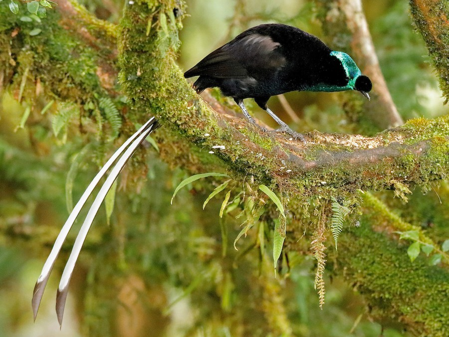

So, what would slower "training bikes" look like? Fortunately, Zwift HQ has already built some.

1.  The Buffalo Bike - the Buffalo Fahrrad - a heavy single speed bike with a coaster brake, built for the World Bicycle Relief event (and built IRL for durable low-cost transportation) is a perfect, distinctive "training bike".\
    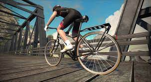

2.  The Big Wheel Bike - used on April Fools' Day in 2015 and 2021.\
    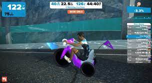

3.  The old-timey bike from April 2016 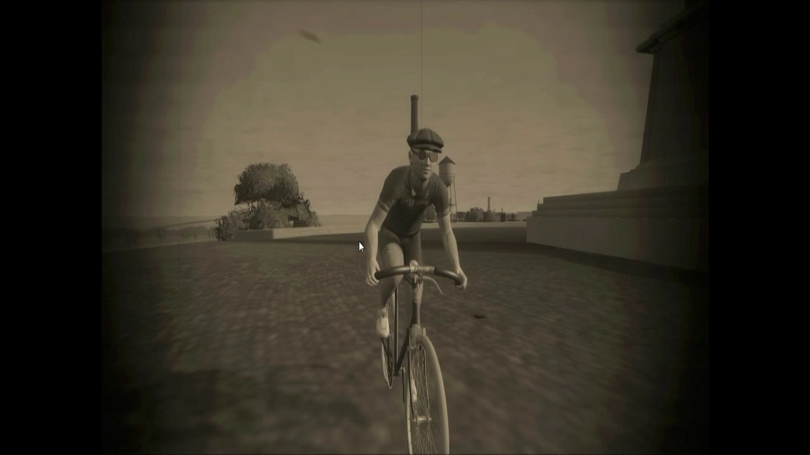

## How would Slow Training Bikes Perform?

We would want steps that are roughly equivalent to the road to gravel bike, and the gravel to mountain bike transitions, and have enough training bikes to get us even steps up to 30% (where the next Pace Partner is). This would be about 4% per step, so the performance would look like the table below.

| Bike         | 2 lap Tempus Fugit time | Time in sec | Percent Slower |
|--------------|-------------------------|-------------|----------------|
| Zwift Steel  | 52:40                   | 3100        | --             |
| Zwift Gravel | 53:54                   | 3174        | 2.39           |
| Zwift MTB    | 55:53                   | 3348        | 6.23           |
| Training 1   | 57:50                   | 3410        | 10.00          |
| Training 2   | 59:54                   | 3534        | 14.00          |
| Training 3   | 60:56                   | 3596        | 16.00          |
| Training 4   | 62:00                   | 3720        | 20.00          |
| Training 5   | 64:04                   | 3844        | 24.00          |
| Training 6   | 66:08                   | 3968        | 28.00          |

: Zwift Insider Time for 2 laps of Tempus Fugit with a 183 cm rider weighing 75kg for Different Bikes with Zwift 32 mm Carbon wheels (with proposed Training Bikes added)

When you can ride comfortably with C. Cadence for an hour (pick your time), you can then try to do this with a gravel bike. When that is comfortable, you can step up to a mountain bike. Then onward through Training bikes 1-6. When you can do this with Training bike 6 comfortably, you are ready to step up to riding with the next Pace Partner, B. Brevet, (but now on a road bike). This sets up a very straightforward training plan for anyone who wants to use Progressive Resistance Training to improve their strength and speed.

## What Would Slow Trainer Bikes Look Like?

The Buffalo Bike and the Big Wheel bike would be a great start, and each offers a distinctive look. What could some other distinctive training bikes look like? Here are some ideas (tell me which you like most, what order (progressive resistance - from low to high resistance) they should go in, and add more ideas in the comments):

1.  High-wheeler (pennyfarthing) bike (rider might get 1890s stripes and mustache)

    \
    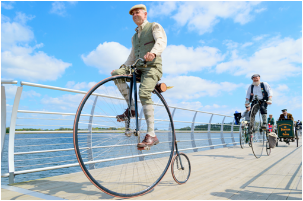

1.  Beach Cruiser with fat tires, spilling sand\
    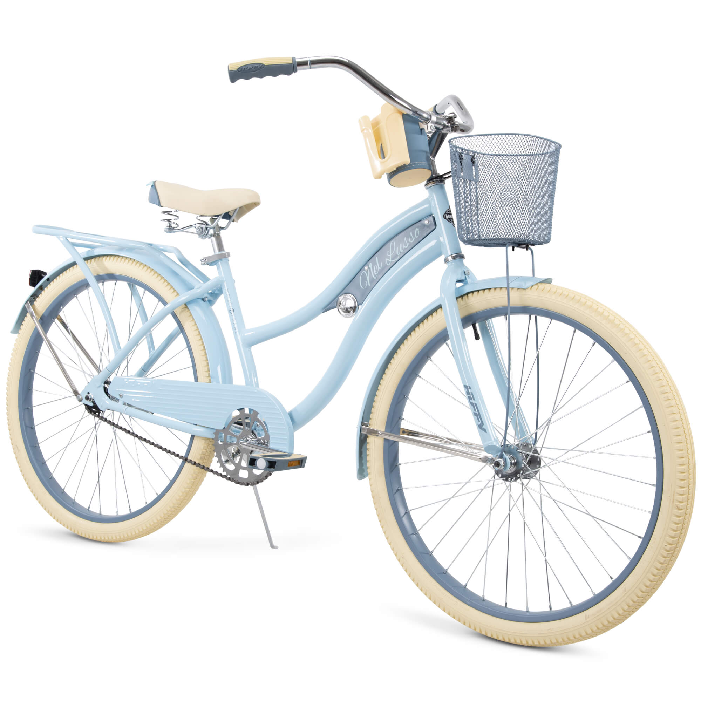
2.  Electra flat-foot Townie bike with baskets full of groceries
     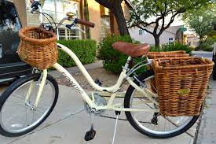
3.  Bianchi City Vintage with a rear-mounted espresso machine
     
4.  Full Dutch Grandma bike (Omafiets) with basket, panniers, mudguards, and baby trailer\
     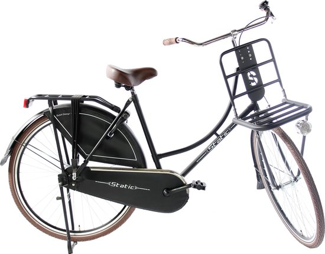
5.  Cargo bike (could be a front-loader (bakfiet) - like the Larry vs. Harry Bullitt or a longtail like the Surly Big Fat Dummy)\
 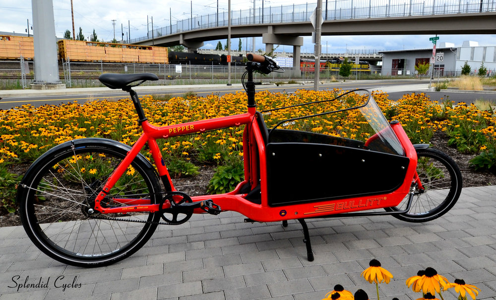

 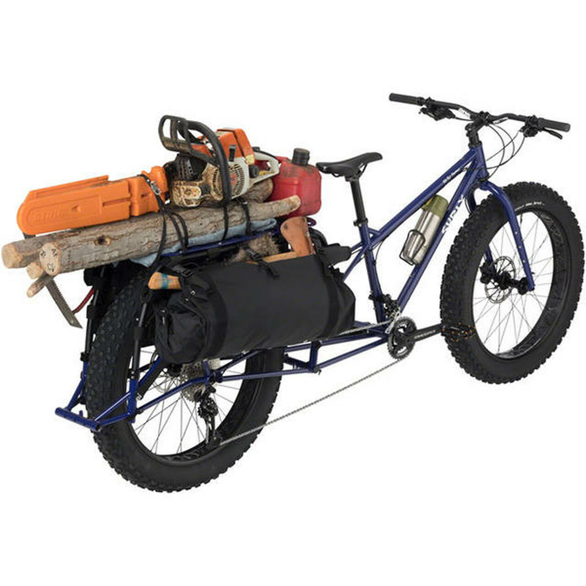
 
We need 6 more training bikes in addition to the Gravel and Mountain bikes. Which would you like to see, and in what order? Mark which end is low vs high resistance, and let us know in the comments.

## What About PRE for Runners?

The running Pace Partners have gradations of 13%, so it would be nice to have Visual Resistance Levels that are roughly \~ 2% progressive resistance steps, in addition to the 5 evenly-spaced Pace partners.

| Pace Partner  | mile Pace | km Pace | Percent Change | Color  |
|---------------|-----------|---------|----------------|--------|
| Eva Endura    | 12:04     | 7:33    | --             | Blue   |
| Dax Diesel    | 10:30     | 6:34    | 13.0%          | Green  |
| Cara Cadence  | 9:08      | 5:43    | 13.0%          | Yellow |
| Billie Benoit | 7:57      | 4:58    | 13.0%          | Orange |
| Alton Able    | 6:55      | 4:19    | 13.0%          | Red    |

What might these visual resistance levels look like?

Zwift HQ has already built one VRL, the Astronaut suit from April Fool's day 2021.

These Visual Resistance Levels (VRLs) could be simple, visible ways to slow down a runner. These could include:

1.  Running while wearing military boots instead of modern lightweight running shoes\
     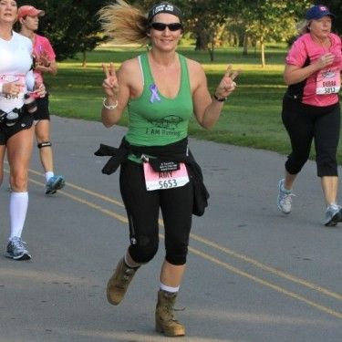
2.  Running with a full backpack\
     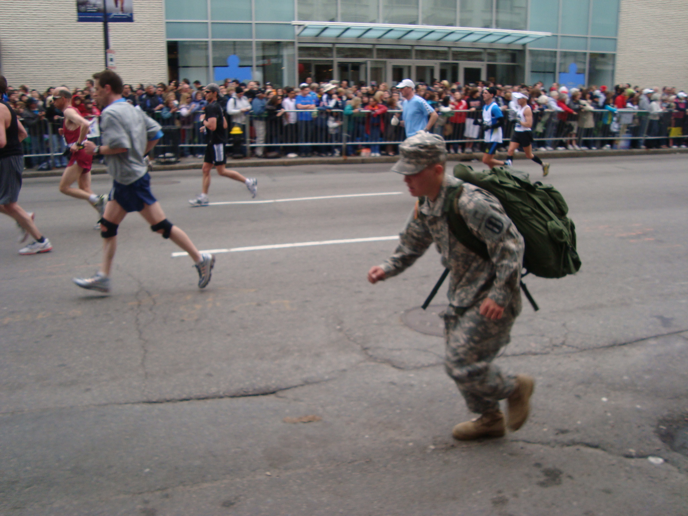
3.  Running with a mini-parachute\
     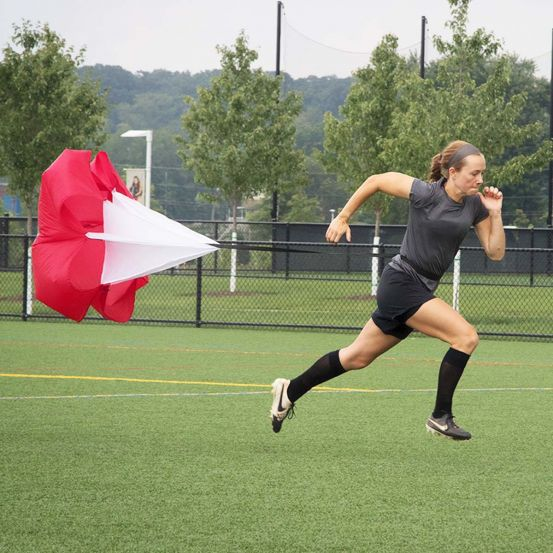
4.  Running with a weighted vest\
     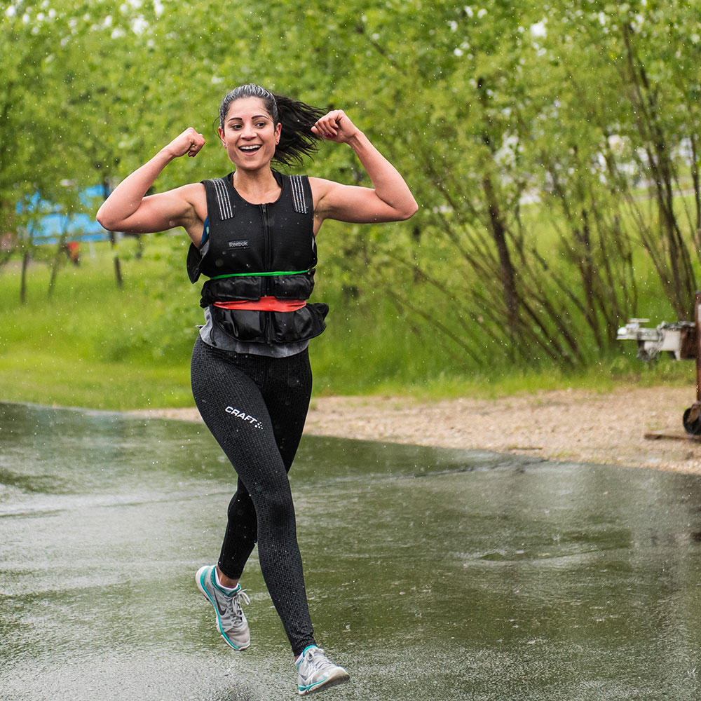
5.  Rnning while pushing a pram/stroller\
     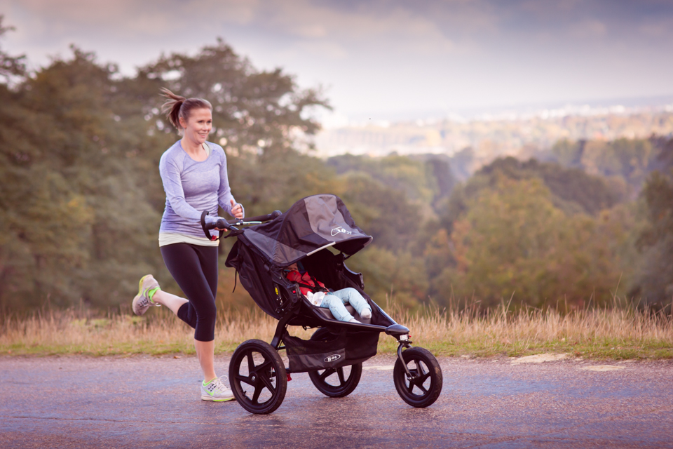
6.  Running in an Astronaut suit (April 2021)\
     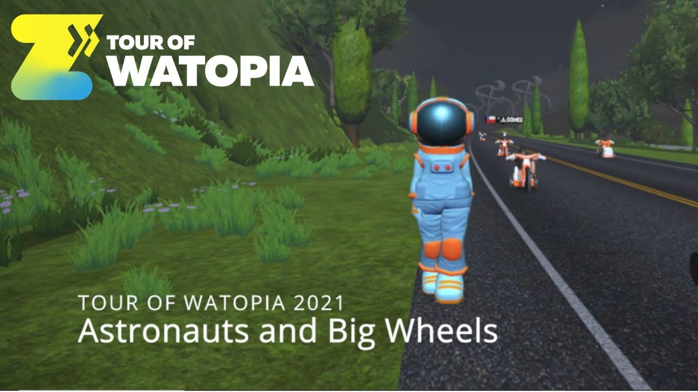
7.  Running while pulling a trailer/ pull a ball and chain\
     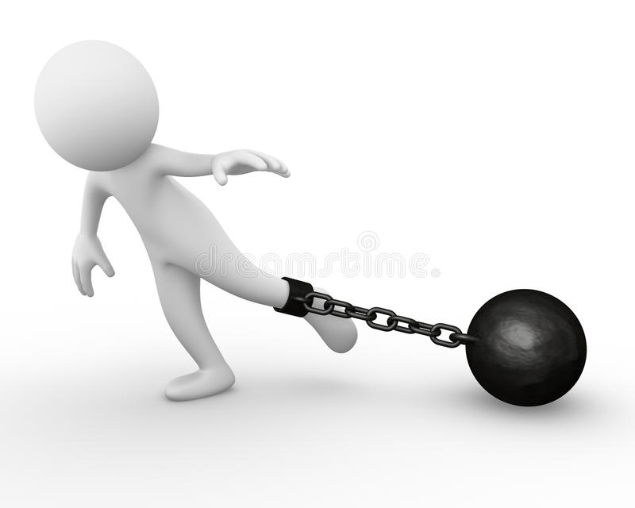

Please note which suggestions you like, and suggest others (and the order they should go in for progressive resistance steps, with the low and high resistance marked) in the comments below.

Ideally, you would add 2% resistance at each step, and have 6 grades of resistance (2, 4, 6, 8, 10, 12%) (Visual Resistance Levels) that are harder than using the standard running gear. This would produce 7 (normal gear plus 6 resistance steps) x 5 (Pace Partners) = 35 levels of Progressive Resistance Training. Once you are comfortable at training level 6 (12% harder than normal), you should be able to step up to the next Pace Partner (13%) when running in normal gear.

## Many options for PRE

This proposed approach (adding one more Pace Partner for both cycling and running & adding levels of resistance) would produce 45 levels of resistance for cycling and 35 levels of resistance for running. For folks who don't love disciplined training plans, this PRE approach may be a better fit.

This approach also seems to fit better with the computational resources and current structure of Zwift compared to trying to create custom Pace Partners for everyone.

What do you think?

Would this (roughly) approximate a custom Pace Partner and give Zwifters what they want for PRE? How would you make this better? Are 4% resistance steps for cycling and 2% steps for running the right size? What are your suggestions for visual resistance levels for cycling and running? How would you order these from low to high resistance? Let us know it the comments.
